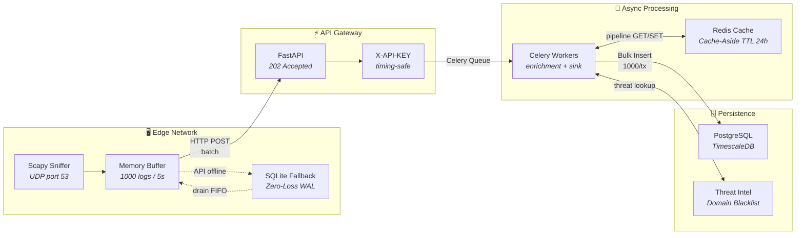

# 🛡️ NovaGuard — Plataforma de Inteligência e Ameaças DNS

[](https://github.com/soneylegal/novaguarda/actions/workflows/ci.yml)
[](https://www.python.org/)
[](https://github.com/psf/black)
[](LICENSE)

> **Enterprise Data Pipeline** distribuído de alta resiliência para ingestão, enriquecimento e análise de tráfego DNS em tempo real. Projetado para processar **milhões de logs/dia** com latência de ingestão < 50ms e garantia de **zero data loss**.

---

## Arquitetura



### Fluxo de Dados (End-to-End)

| Etapa | Componente | Operação | SLA |
|:---:|---|---|---|
| **1** | Scapy Sniffer | Captura DNS (`udp port 53`, `store=False`) | Real-time |
| **2** | Memory Buffer | Acumula logs (1000 ou 5s, o que vier primeiro) | < 5s |
| **3** | HTTP Sender | POST batch para API Gateway com `X-API-KEY` | < 100ms |
| **4** | FastAPI | Valida payload, enfileira no Celery | **< 50ms** (202) |
| **5** | Enrichment Worker | Cache-Aside: Redis → threat_intel → classifica | < 200ms |
| **6** | Sink Worker | `INSERT INTO dns_logs VALUES (...) × 1000` | < 500ms |
| **7** | Fallback (se API ↓) | SQLite WAL + Exponential Backoff (2s → 300s) | Zero-loss |

---

## Stack Tecnológico

| Componente | Tecnologia | Propósito |
|---|---|---|
| **API Framework** | FastAPI | I/O assíncrono, OpenAPI nativo, validação Pydantic v2 |
| **Task Queue** | Celery + Redis | Processamento assíncrono com filas separadas (`enrichment`, `sink`) |
| **Cache** | Redis | Cache-Aside com pipeline batch (TTL 24h, sub-ms latency) |
| **Banco de Dados** | PostgreSQL + TimescaleDB | Particionamento por data, queries de séries temporais otimizadas |
| **ORM** | SQLAlchemy 2.0 | Dual engine (async `asyncpg` + sync `psycopg2`) + Repository Pattern |
| **Rate Limiting** | slowapi | Proteção anti-DDoS na camada de aplicação |
| **Autenticação** | API Keys (`X-API-KEY`) | `secrets.compare_digest` — imune a timing side-channel attacks |
| **Captura de Rede** | Scapy | Parsing DNS em userspace, filtragem por protocolo |
| **Containerização** | Docker + docker-compose | Stack reproduzível com healthchecks |
| **CI/CD** | GitHub Actions | Lint (Black, Ruff, MyPy) + Testes automatizados |

---

## Início Rápido

### 1. Clonar e configurar

```bash
git clone https://github.com/soneylegal/novaguarda.git
cd novaguarda
cp .env.example .env
```

### 2. Subir a stack completa

```bash
docker compose up -d --build
```

| Serviço | URL | Descrição |
|---|---|---|
| API Gateway | `http://localhost:8000` | FastAPI (OpenAPI docs em `/docs`) |
| Swagger UI | `http://localhost:8000/docs` | Documentação interativa da API |
| Flower | `http://localhost:5555` | Monitoramento de workers Celery |
| PostgreSQL | `localhost:5432` | TimescaleDB (time-series) |
| Redis | `localhost:6379` | Cache (DB0) + Broker (DB1) |

### 3. Desenvolvimento local

```bash
python -m venv .venv
source .venv/bin/activate
pip install -e ".[dev]"
```

### 4. Executar testes

```bash
pytest tests/ -v --cov=backend --cov=agent --cov-report=term-missing
```

### 5. Executar o agente de borda

```bash
sudo python -m agent.sniffer \
  --interface eth0 \
  --api-url http://localhost:8000/api/v1/ingest \
  --api-key "agent-key-alpha-001" \
  --buffer-size 1000 \
  --buffer-interval 5
```

---

## API Endpoints

### Ingestão (Alta Performance)

| Método | Rota | Descrição | Auth | Response |
|---|---|---|---|---|
| `POST` | `/api/v1/ingest/` | Recebe lote de logs DNS | `X-API-KEY` | `202 Accepted` |

### Consulta (Dashboard)

| Método | Rota | Descrição | Auth |
|---|---|---|---|
| `GET` | `/api/v1/query/logs` | Listagem paginada com filtros (domínio, threat, agente, IP, período) | `X-API-KEY` |
| `GET` | `/api/v1/query/stats` | Estatísticas agregadas (total, 24h, por severidade) | `X-API-KEY` |
| `GET` | `/api/v1/query/threats` | Top N domínios maliciosos com IPs de origem | `X-API-KEY` |
| `GET` | `/api/v1/query/health` | Health check (Redis, PostgreSQL, Celery) | Público |

---

## Padrões de Design

### 🏗️ Repository Pattern — Isolamento Total de Persistência

O código de negócios **nunca toca diretamente no ORM**. Toda interação com o banco passa por repositórios tipados, permitindo troca de engine (ex: PostgreSQL → ClickHouse) sem alterar uma linha de lógica de negócios. Testes unitários usam `MagicMock` no lugar da sessão real — **zero dependência de infraestrutura para validar regras de negócio**.

### ⚡ Cache-Aside — Classificação de Domínios em Sub-Milissegundos

Cada lote de logs é deduplicado por domínio. O worker executa um **Redis pipeline batch** (N GETs em 1 roundtrip). Cache hits retornam classificação instantânea. Misses consultam a tabela `threat_intel`, classificam e populam o cache com **TTL de 24 horas**. Na prática, após warm-up, **95%+ dos domínios são resolvidos via cache** — eliminando queries repetidas ao banco.

### 🔄 Exponential Backoff — Resiliência de Rede Guarantida

Se o API Gateway estiver indisponível, o agente **nunca descarta logs**. Os dados são persistidos em SQLite local (WAL mode) e o retry segue backoff exponencial: `2s → 4s → 8s → 16s → ... → 300s (cap)`. Ao reconectar, o agente **drena o SQLite em ordem FIFO** antes de enviar novos dados. Resultado: **zero data loss** mesmo com horas de downtime.

### 📦 Bulk Inserts — Throughput de Escrita Maximizado

Logs são persistidos em lotes de **1.000 registros por transação** via `INSERT INTO ... VALUES (...), (...), ...` — eliminando overhead de ORM individual. Lotes maiores são automaticamente particionados em chunks para **evitar locks prolongados** no PostgreSQL. Este padrão reduz o número de transações em **~1000x** comparado com inserts individuais.

---

## Estrutura do Projeto

```
novaguarda/
├── agent/                       # 🖥️ Sniffer Edge (máquinas alvo)
│   ├── sniffer.py               #    Captura Scapy + parsing DNS
│   └── buffer_sender.py         #    Buffer memória + backoff + SQLite fallback
├── backend/
│   ├── main.py                  # ⚡ FastAPI + Middlewares + CORS + Lifespan
│   ├── core/                    # 🔧 Configuração e Segurança
│   │   ├── config.py            #    Pydantic Settings (.env)
│   │   ├── security.py          #    API Key auth (timing-safe)
│   │   └── cache.py             #    Redis singleton + Cache-Aside batch
│   ├── api/v1/                  # 🌐 Controllers (HTTP)
│   │   ├── ingest_router.py     #    POST /ingest → 202 Accepted
│   │   └── query_router.py      #    GET /logs, /stats, /threats, /health
│   ├── domain/                  # 📐 Entidades de Negócio (Pydantic)
│   │   └── schemas.py           #    DNSLogItem, LogBatchCreate, EnrichedLog...
│   ├── infrastructure/          # 🗄️ Acesso a Dados
│   │   ├── db/
│   │   │   ├── session.py       #    Async + Sync engines (dual pool)
│   │   │   └── models.py        #    DNSLog, ThreatIntel, AgentRegistry
│   │   └── repositories/
│   │       ├── base.py          #    CRUD genérico (Generic[ModelType])
│   │       └── log_repo.py      #    Bulk insert + aggregations + dashboard
│   └── workers/                 # 🧠 Processamento em Background
│       ├── celery_app.py        #    Filas: enrichment, sink
│       ├── intel_tasks.py       #    Cache-Aside enrichment pipeline
│       └── sink_tasks.py        #    Chunked bulk persist (1000/tx)
├── .github/workflows/ci.yml    # 🔄 GitHub Actions (lint + test)
├── docker-compose.yml           # 🐳 Stack: API + TimescaleDB + Redis + Worker + Flower
├── Dockerfile                   # 📦 Multi-stage build (python:3.11-slim)
├── alembic/                     # 🔀 Migrações de banco (autogenerate)
├── tests/
│   ├── e2e/test_api.py          # 🧪 TestClient + dependency_overrides
│   └── unit/                    # 🧪 pytest + MagicMock
└── pyproject.toml               # 📋 Dependencies + Black + Ruff + MyPy
```

---

## Testes

> **31 testes a passar** — 25 Unitários + 6 E2E — com mock do Repository e API TestClient.

| Suite | Testes | Cobertura | Estratégia |
|---|:---:|---|---|
| `test_schemas.py` | 11 | Validação Pydantic (domain, IP, batch, enum) | Sem mocks — Pydantic puro |
| `test_buffer_sender.py` | 9 | Buffer, flush, backoff, SQLite fallback | `MagicMock(send_batch)` |
| `test_repository.py` | 4 | SyncLogRepository (bulk, threats, close) | `MagicMock(session)` |
| `test_api.py` | 6 | Root, Ingest (401/403/422/202), X-Request-ID | `TestClient` + `dependency_overrides` |
| **Total** | **31** | | **Zero dependência de infra** |

---

## Variáveis de Ambiente

Todas centralizadas em `.env` e carregadas via `pydantic_settings.BaseSettings`:

| Variável | Descrição | Default |
|---|---|---|
| `DATABASE_URL` | PostgreSQL async (`asyncpg`) | `postgresql+asyncpg://...` |
| `DATABASE_URL_SYNC` | PostgreSQL sync (`psycopg2`) | `postgresql+psycopg2://...` |
| `REDIS_URL` | Redis cache (DB 0) | `redis://localhost:6379/0` |
| `CELERY_BROKER_URL` | Redis broker (DB 1) | `redis://localhost:6379/1` |
| `API_KEYS` | JSON array de chaves autorizadas | `[]` |
| `RATE_LIMIT` | Limite de requisições (slowapi) | `60/minute` |
| `CACHE_TTL_SECONDS` | TTL do cache Redis | `86400` (24h) |
| `BULK_INSERT_SIZE` | Logs por transação de insert | `1000` |

---

## Licença

Distribuído sob a licença MIT. Veja [`LICENSE`](LICENSE) para mais informações.

© 2026 Davi Laurindo
