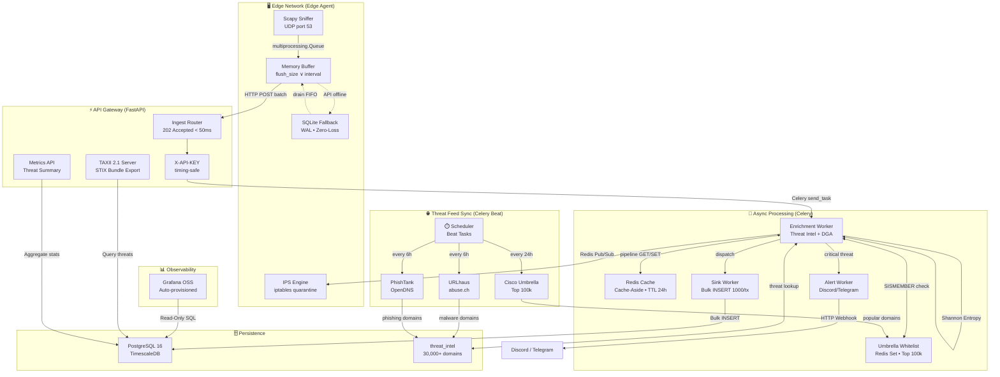

<div align="center">

# 🛡️ NovaGuard

### DNS Threat Intelligence & Network Defense Platform

[](https://github.com/soneylegal/novaguarda/actions/workflows/ci.yml)
[](https://www.python.org/)
[](#-test-evidence)
[](https://github.com/psf/black)
[](#phase-5-stixTAXII-21-threat-sharing)
[](#phase-6-automated-threat-feed-sync)
[](LICENSE)

**Enterprise-grade distributed pipeline** for real-time DNS traffic ingestion, threat enrichment, active prevention, and intelligence sharing.
From **packet capture to STIX 2.1 bundle** — with automated threat feed sync (**30,000+ domains**), multivariate DGA detection, and **zero data loss**.

</div>

---

## 📐 System Architecture



### Data Flow (End-to-End)

| Stage | Component | Operation | SLA |
|:---:|---|---|:---:|
| **1** | Scapy Process | Packet capture (`udp port 53`, `store=False`) | Real-time |
| **2** | IPC Queue | `multiprocessing.Queue` → BufferSender process | < 1ms |
| **3** | BufferSender | Accumulate → HTTP POST batch to API Gateway | ≤ flush interval |
| **4** | FastAPI | Validate payload, enqueue to Celery | **< 50ms** (202) |
| **5** | Enrichment Worker | Cache-Aside: Redis → Umbrella Whitelist → `threat_intel` → DGA Entropy+Density → classify | < 200ms |
| **6** | Alert Worker | Format + dispatch webhook (Discord/Telegram) | < 500ms |
| **7** | Sink Worker | `INSERT INTO dns_logs VALUES (...) × 1000` | < 500ms |
| **8** | IPS Engine | Redis Pub/Sub → `iptables -A INPUT -s <IP> -j DROP` | < 1s |
| **9** | Fallback | SQLite WAL + Exponential Backoff (2s → 300s cap) | Zero-loss |
| **10** | Feed Sync | Celery Beat → URLhaus + PhishTank → `threat_intel` upsert | Every 6h |

---

## 🏗️ Engineering Trail — Phase Validation

All 6 phases of the NovaGuard roadmap have been implemented, tested, and validated end-to-end on a live Docker stack. Below is the engineering evidence for each phase.

### Phase 1: Observability (Grafana OSS)

| Item | Evidence |
|---|---|
| **Service** | `grafana/grafana-oss:latest` in `docker-compose.yml` |
| **Data Source** | Read-only PostgreSQL connection auto-provisioned via `grafana/provisioning/` |
| **Dashboard** | `grafana/dashboards/novaguard_dashboard.json` (7.6 KB, auto-loaded) |
| **Panels** | DNS queries/24h, Malicious vs Benign time-series, Top 10 Threat Domains, Top 10 Infected Hosts, Threat Type distribution |
| **Access** | `http://localhost:3000` (admin/admin) |

### Phase 2: Real-Time Alerts (Webhooks)

| Item | Evidence |
|---|---|
| **Task** | `send_alert_task` in [`alert_tasks.py`](backend/workers/alert_tasks.py) — Celery task with `max_retries=3`, `acks_late=True` |
| **Channels** | Discord (rich embed with color-coded severity), Telegram, generic JSON webhook |
| **Severity Map** | `C2_SERVER` → 🚨 CRITICAL (red) · `MALWARE` → ⚠️ HIGH (orange) · `PHISHING` → 🔍 MEDIUM (yellow) · `DGA` → 🧠 MEDIUM (yellow) |
| **Tests** | 5 unit tests in `test_alert_tasks.py` — skip logic, Discord formatting, DGA alert, retry on HTTP error |

### Phase 3: IDS → IPS (Active Prevention)

| Item | Evidence |
|---|---|
| **Publisher** | [`intel_tasks.py:L206-221`](backend/workers/intel_tasks.py) — Celery worker publishes `quarantine` command to Redis Pub/Sub channel `novaguard:ips:commands` on `malicious` detection |
| **Subscriber** | [`sniffer.py:L173-303`](agent/sniffer.py) — Dedicated `_ips_worker` process listens on Redis Pub/Sub, applies `iptables -A INPUT -s <IP> -j DROP` |
| **Safety** | Whitelist includes `127.0.0.1`, `1.1.1.1`, `8.8.8.8`, and the agent's own interface IP to prevent lockout |
| **Un-quarantine** | Supports `un-quarantine` command to remove firewall rules dynamically |

**Live validation evidence:**
```json
// Received on Redis channel "novaguard:ips:commands" after injecting c2-strike.net
{
    "command": "quarantine",
    "source_ip": "10.155.155.155",
    "domain": "c2-strike.net",
    "threat_type": "c2_server",
    "timestamp": "2026-05-21T14:27:08.120601Z"
}
```

### Phase 4: DGA Detection (Shannon Entropy + Density Filters)

| Item | Evidence |
|---|---|
| **Module** | [`entropy.py`](backend/core/entropy.py) — Shannon Entropy + Multivariate Decision Rule |
| **Formula** | $H(X) = -\sum_{i=1}^{n} P(x_i) \log_2 P(x_i)$ |
| **Density Filters** | Vowel Ratio < 20% · Digit Ratio > 20% · Max Consonant Cluster > 4 |
| **Decision Rule** | Suspicious = `Entropy ≥ 3.2` **AND** `≥1 density filter triggers` |
| **False Positive Fix** | `githubusercontent` (H=3.45, 35% vowels) → SAFE · `xjz897fka31s` (H=3.58, 8% vowels, 42% digits) → SUSPECT |
| **Integration** | [`intel_tasks.py`](backend/workers/intel_tasks.py) — `is_dga_suspicious()` with structured logging |
| **Tests** | 17 unit tests in `test_entropy.py` — SLD extraction, density features, false positive regression, true positive validation |

**Live validation evidence:**
```
  githubusercontent    H=3.45  Vowel=35.3%  Digit=0.0%  MaxCC=2  → ✅ SAFE
  google-analytics    H=3.50  Vowel=37.5%  Digit=0.0%  MaxCC=3  → ✅ SAFE
  xjz897fka31s        H=3.58  Vowel= 8.3%  Digit=41.7% MaxCC=3  → ⚠️ SUSPECT
  qweasdzxcrty        H=3.58  Vowel=16.7%  Digit=0.0%  MaxCC=8  → ⚠️ SUSPECT
```

### Phase 5: STIX/TAXII 2.1 Threat Sharing

| Item | Evidence |
|---|---|
| **Router** | [`taxii_router.py`](backend/api/v1/taxii_router.py) — Full TAXII 2.1 server (Discovery, API Root, Collections, Objects) |
| **MIME Types** | `application/taxii+json;version=2.1` (TAXII) · `application/stix+json;version=2.1` (STIX Bundle) |
| **STIX Objects** | `indicator` (malicious domain) + `observed-data` (source IP) + `relationship` (indicates) |
| **Idempotency** | UUIDs via `uuid.uuid5(NAMESPACE_DNS, domain)` — same domain always generates the same indicator ID |
| **Metrics** | `GET /api/v1/metrics/threat-summary` — aggregated threat counts, top IPs, top domains |
| **Tests** | 9 unit tests in `test_taxii.py` covering auth, headers, payloads, and STIX bundle structure |

### Phase 6: Automated Threat Feed Sync

| Item | Evidence |
|---|---|
| **Scheduler** | Celery Beat (`crontab`) — automatic threat feed sync every 6h, Umbrella whitelist sync every 24h |
| **URLhaus** | [abuse.ch](https://urlhaus.abuse.ch/) — malware, C2, droppers (584 domains) |
| **PhishTank** | [OpenDNS](https://phishtank.org/) — verified phishing (30,038 domains) |
| **Cisco Umbrella** | Global popularity whitelist (Top 100,000 domains) for automatic false positive bypass |
| **Task** | [`feed_tasks.py`](backend/workers/feed_tasks.py) — `sync_urlhaus`, `sync_phishtank`, `sync_top_domains`, `sync_all_feeds` |
| **Upsert** | Idempotent ORM insert (threats) + Redis Pipeline SADD (Umbrella whitelist) |
| **Service** | `beat` container in `docker-compose.yml` with `PersistentScheduler` |
| **Total** | **30,630+ threat domains** (PG) + **100,000 whitelisted popular domains** (Redis set) |

**Live sync evidence:**
```
URLhaus: 565 unique domains extracted → 23 inserted, 542 skipped
PhishTank: 30049 unique domains extracted → 30038 inserted, 11 skipped
Feed sync complete. Total new domains: 30061 — succeeded in 257.87s
```

---

## 🧪 Test Evidence

> **81 tests passing** — Unit + E2E — with full infrastructure mocking.

```
tests/e2e/test_api.py ......                                             [  7%]
tests/unit/test_alert_tasks.py .....                                     [ 13%]
tests/unit/test_buffer_sender.py .........                               [ 24%]
tests/unit/test_celery_tasks.py .....                                    [ 30%]
tests/unit/test_entropy.py ....................                          [ 55%]
tests/unit/test_feed_tasks.py .....                                      [ 61%]
tests/unit/test_repository.py .......                                    [ 70%]
tests/unit/test_schemas.py ............                                  [ 85%]
tests/unit/test_taxii.py .........                                       [ 96%]
tests/unit/test_umbrella_whitelist.py ...                                [100%]

============================== 81 passed in 3.64s =============================
```

| Suite | Tests | Coverage |
|---|:---:|---|
| `test_api.py` | 6 | E2E: root, auth (missing/invalid key), validation, ingest, security middleware |
| `test_alert_tasks.py` | 5 | Webhook skip, Discord embed, DGA formatting, generic JSON, retry on failure |
| `test_buffer_sender.py` | 9 | Buffer enqueue/flush, exponential backoff, SQLite fallback persist/drain/stats |
| `test_celery_tasks.py` | 5 | Enrichment smoke (empty/single/DGA), sink persist (empty/batch) |
| `test_entropy.py` | 20 | SLD extraction, Shannon entropy, density features, DGA multivariate verdict, false positive regression |
| `test_feed_tasks.py` | 5 | Ingestion of threat feeds, whitelisting logic |
| `test_repository.py` | 7 | Bulk insert, threat domain lookup, threat type mapping, session close |
| `test_schemas.py` | 12 | Pydantic validation: domain, IP, batch, enum, normalization, max length |
| `test_taxii.py` | 9 | TAXII discovery/auth, API root, collections, STIX bundle, metrics endpoint |
| `test_umbrella_whitelist.py` | 3 | Cisco Umbrella download, extraction, Redis SADD pipeline, and real-time bypass in worker |
| **Total** | **81** | **Zero infrastructure dependency** |

---

## ⚙️ Tech Stack

| Layer | Technology | Purpose |
|---|---|---|
| **API** | FastAPI | Async I/O, OpenAPI native, Pydantic v2 validation |
| **Task Queue** | Celery + Redis | Async processing with dedicated queues (`enrichment`, `sink`, `alerts`, `feeds`) |
| **Scheduler** | Celery Beat | Automatic threat feed sync every 6 hours |
| **Cache** | Redis 7 | Cache-Aside with pipeline batch (TTL 24h, sub-ms latency) |
| **IPS Channel** | Redis Pub/Sub | Real-time quarantine commands to edge agents |
| **Database** | PostgreSQL 16 + TimescaleDB | Time-series optimized with composite indexes |
| **ORM** | SQLAlchemy 2.0 | Dual engine: async `asyncpg` (API) + sync `psycopg2` (Workers) |
| **Edge Capture** | Scapy | DNS parsing in userspace, isolated in `multiprocessing.Process` |
| **Resilience** | SQLite WAL | Local fallback with exponential backoff, zero data loss |
| **DGA Detection** | Shannon Entropy + Density Filters | Multivariate DGA classifier (entropy ≥ 3.2 + vowel/digit/cluster analysis) |
| **Threat Feeds** | URLhaus + PhishTank + Cisco Umbrella | Auto-sync: 30,000+ malicious domains (every 6h) + 100,000 popular domains whitelist (every 24h) |
| **Threat Sharing** | STIX/TAXII 2.1 | OASIS-compliant indicator and observed-data bundles |
| **Alerting** | HTTP Webhooks | Discord (rich embed), Telegram, generic JSON |
| **Observability** | Grafana OSS | Auto-provisioned dashboards with read-only PostgreSQL |
| **Auth** | API Keys (`X-API-KEY`) | `secrets.compare_digest` — immune to timing side-channel |
| **CI/CD** | GitHub Actions | Lint (Black, Ruff, MyPy) + Tests with real PostgreSQL/Redis |
| **Containers** | Docker Compose | 8 services with healthchecks and wait-for-db |

---

## 🚀 Quick Start

### 1. Clone & Configure

```bash
git clone https://github.com/soneylegal/novaguarda.git
cd novaguarda
cp .env.example .env
```

### 2. Launch Backend (Docker)

```bash
docker compose up -d --build
```

| Service | URL | Description |
|---|---|---|
| API Gateway | `http://localhost:8000` | FastAPI (OpenAPI docs at `/docs`) |
| Swagger UI | `http://localhost:8000/docs` | Interactive API documentation |
| Grafana | `http://localhost:3000` | Observability dashboards (admin/admin) |
| Flower | `http://localhost:5555` | Celery worker monitoring |

> **Note:** Databases are exposed on TCP ports `5433` (PostgreSQL/TimescaleDB) and `6379` (Redis). They do not serve HTTP responses.
>
> The `beat` service runs alongside the worker and handles automatic feed sync (URLhaus + PhishTank) every 6 hours.

### 3. Seed Threat Intelligence (Optional — feeds sync automatically)

```bash
# Manual seed (one-time bootstrap, feeds auto-sync after)
docker compose run --rm api python -m scripts.seed_urlhaus
docker compose run --rm api python -m scripts.seed_threat_intel
```

---

## 🖥️ Edge Agent Setup

The Edge Agent captures live DNS traffic, streams it to the API, and listens for IPS quarantine commands. Requires **root privileges** (or `CAP_NET_RAW`).

```bash
# Install
python -m venv .venv && source .venv/bin/activate && pip install -e ".[dev]"

# Launch (recommended)
./run_agent.sh --interface enp1s0 --buffer-size 50 --buffer-interval 5

# Or directly
sudo ./.venv/bin/python -m agent.sniffer \
  --interface enp1s0 \
  --api-url http://localhost:8000/api/v1/ingest/ \
  --api-key "agent-key-alpha-001" \
  --buffer-size 50 \
  --buffer-interval 5
```

The agent spawns **3 isolated OS processes** (GIL-free):
1. **Scapy Worker** — Packet capture (`udp port 53`)
2. **Buffer Sender** — Queue-driven HTTP sender + SQLite fallback
3. **IPS Worker** — Redis Pub/Sub listener → `iptables` quarantine

> **Graceful Shutdown:** Press `Ctrl+C` once. The agent stops Scapy, drains the IPC queue, flushes remaining logs, and exits cleanly.

---

## 📡 API Reference

### Ingestion

| Method | Route | Description | Auth | Response |
|---|---|---|---|---|
| `POST` | `/api/v1/ingest/` | Receive batch of DNS logs | `X-API-KEY` | `202 Accepted` |

### Query (Dashboard)

| Method | Route | Description | Auth |
|---|---|---|---|
| `GET` | `/api/v1/query/logs` | Paginated listing with filters | `X-API-KEY` |
| `GET` | `/api/v1/query/stats` | Aggregated statistics | `X-API-KEY` |
| `GET` | `/api/v1/query/threats` | Top N malicious domains | `X-API-KEY` |
| `GET` | `/api/v1/query/health` | Health check (Redis, PostgreSQL, Celery) | Public |

### TAXII 2.1 (Threat Sharing)

| Method | Route | MIME Type | Description |
|---|---|---|---|
| `GET` | `/api/v1/taxii2/` | `application/taxii+json;version=2.1` | Server discovery |
| `GET` | `/api/v1/taxii2/root/` | `application/taxii+json;version=2.1` | API root metadata |
| `GET` | `/api/v1/taxii2/root/collections/` | `application/taxii+json;version=2.1` | List collections |
| `GET` | `/api/v1/taxii2/root/collections/{id}/objects/` | `application/stix+json;version=2.1` | STIX 2.1 Bundle |

### Metrics

| Method | Route | Description | Auth |
|---|---|---|---|
| `GET` | `/api/v1/metrics/threat-summary` | Aggregated threat counts, top IPs, top domains | `X-API-KEY` |

---

## 🏛️ Design Patterns

### 🏗️ Repository Pattern
Business logic **never touches the ORM directly**. All database access flows through typed repositories, enabling engine swaps without modifying business rules.

### ⚡ Cache-Aside (Redis Pipeline Batch)
Each log batch is deduplicated by domain. The enrichment worker executes a **Redis pipeline** (N GETs in 1 roundtrip). After warm-up, **95%+ domains resolve via cache**.

### 🔄 IPC via multiprocessing (GIL-Free)
Scapy, HTTP sender, and IPS listener run in **separate OS processes** via `multiprocessing.Queue`. No GIL contention. Shutdown uses a `STOP_SENTINEL` pattern.

### 📦 Bulk Inserts (1000/transaction)
Logs are persisted in batches of **1,000 records per transaction**. Reduces transaction count by **~1000x** vs individual inserts.

### 🛡️ Zero Data Loss (SQLite Fallback)
If the API is unreachable, logs persist in **SQLite (WAL mode)** with exponential backoff: `2s → 4s → 8s → ... → 300s cap`. On reconnection, the agent **drains in FIFO order**.

### 🧠 Shannon Entropy + Density Filters (DGA Detection)
Domains not found in cache or threat DB pass through a **two-gate classifier**: (1) Shannon Entropy ≥ 3.2 bits, then (2) density filters (vowel ratio, digit ratio, consonant cluster length). This eliminates false positives like `githubusercontent` while catching real DGA like `xjz897fka31s`.

### 🔒 IPS Quarantine (Redis Pub/Sub)
Critical threats trigger automatic network isolation via Redis Pub/Sub → `iptables`. A whitelist prevents accidental lockout of infrastructure IPs.

### 🛡️ Popular Domains Whitelist (Cisco Umbrella)
To prevent high-traffic legitimate global domains (such as CDNs and service providers, e.g., `gstatic.com`, `sharethis.com`) from triggering false positives due to high entropy (DGA) or noisy public feeds, the enrichment worker extracts the registered base domain and performs a batch `SISMEMBER` check against a Redis set containing the **top 100,000 most popular domains on the internet** (updated daily via Cisco Umbrella). A match classifies the domain immediately as `safe`, bypassing database lookups and DGA analysis.

### 🌐 Automated Threat Feeds (Celery Beat)
URLhaus and PhishTank feeds are automatically synchronized every 6 hours via Celery Beat (stored in PostgreSQL), and the Cisco Umbrella popularity whitelist is synchronized daily every 24 hours (stored in Redis), keeping the platform's threat intelligence base continuously updated without manual intervention.

---

## 📁 Project Structure

```
novaguard/
├── agent/                              # 🖥️ Edge Sniffer (target machines)
│   ├── sniffer.py                      #    Orchestrator: Scapy + Sender + IPS processes
│   └── buffer_sender.py                #    Queue-driven sender + SQLite fallback
├── backend/
│   ├── main.py                         # ⚡ FastAPI + Middlewares + CORS + Lifespan
│   ├── core/
│   │   ├── config.py                   #    Pydantic Settings (.env)
│   │   ├── security.py                 #    API Key auth (timing-safe)
│   │   ├── cache.py                    #    Redis singleton + Cache-Aside batch
│   │   └── entropy.py                  #    Shannon Entropy + Density Filters (DGA)
│   ├── api/v1/
│   │   ├── ingest_router.py            #    POST /ingest → 202 Accepted
│   │   ├── query_router.py             #    GET /logs, /stats, /threats, /health, /metrics
│   │   └── taxii_router.py             #    TAXII 2.1 Server (STIX Bundle export)
│   ├── domain/
│   │   └── schemas.py                  #    DNSLogItem, LogBatchCreate, EnrichedLog
│   ├── infrastructure/
│   │   ├── db/
│   │   │   ├── session.py              #    Async + Sync engines (dual pool)
│   │   │   └── models.py              #    DNSLog, ThreatIntel, AgentRegistry
│   │   └── repositories/
│   │       ├── base.py                 #    Generic CRUD (Generic[ModelType])
│   │       └── log_repo.py             #    Bulk insert + aggregations + STIX queries
│   └── workers/
│       ├── celery_app.py               #    Queues: enrichment, sink, alerts, feeds + Beat
│       ├── intel_tasks.py              #    Cache-Aside enrichment + DGA + IPS publish
│       ├── sink_tasks.py               #    Chunked bulk persist (leak-proof)
│       ├── alert_tasks.py              #    Webhook alerts (Discord/Telegram/generic)
│       └── feed_tasks.py              #    Automated feed sync (URLhaus + PhishTank)
├── grafana/
│   ├── provisioning/                   #    Auto-provisioned datasource
│   └── dashboards/                     #    novaguard_dashboard.json
├── tests/
│   ├── e2e/test_api.py                 #    TestClient + dependency_overrides (6 tests)
│   └── unit/                           #    pytest + MagicMock (66 tests)
│       ├── test_alert_tasks.py         #    Webhook formatting + retry (5 tests)
│       ├── test_buffer_sender.py       #    Buffer + SQLite fallback (9 tests)
│       ├── test_celery_tasks.py        #    Enrichment + DGA + sink (5 tests)
│       ├── test_entropy.py             #    Shannon + Density + DGA verdict (17 tests)
│       ├── test_repository.py          #    Repository CRUD (7 tests)
│       ├── test_schemas.py             #    Pydantic validation (12 tests)
│       └── test_taxii.py              #    TAXII/STIX endpoints (9 tests)
├── scripts/
│   ├── seed_threat_intel.py            #    ORM seed: base threat domains
│   ├── seed_urlhaus.py                #    Manual URLhaus import (fallback)
│   └── seed_mixed_test.py             #    ORM seed: stress test domains
├── .github/workflows/ci.yml           #    CI with PostgreSQL + Redis containers
├── docker-compose.yml                  #    7 services with healthchecks
├── Dockerfile                          #    Multi-stage build (python:3.11-slim)
├── ROADMAP.md                          #    Architectural roadmap (6 phases)
├── alembic/                            #    Database migrations (autogenerate)
└── pyproject.toml                      #    Dependencies + Black + Ruff + MyPy
```

---

## 🌍 Environment Variables

All centralized in `.env` and loaded via `pydantic_settings.BaseSettings`:

| Variable | Description | Default |
|---|---|---|
| `DATABASE_URL` | PostgreSQL async (`asyncpg`) | `postgresql+asyncpg://...` |
| `DATABASE_URL_SYNC` | PostgreSQL sync (`psycopg2`) | `postgresql+psycopg2://...` |
| `REDIS_URL` | Redis cache (DB 0) | `redis://localhost:6379/0` |
| `CELERY_BROKER_URL` | Redis broker (DB 1) | `redis://localhost:6379/1` |
| `API_KEYS` | JSON array of authorized keys | `[]` |
| `WEBHOOK_URL` | Alert webhook endpoint | `""` |
| `RATE_LIMIT` | Request rate limit (slowapi) | `60/minute` |
| `CACHE_TTL_SECONDS` | Redis cache TTL | `86400` (24h) |
| `BULK_INSERT_SIZE` | Logs per insert transaction | `1000` |
| `DGA_ENTROPY_THRESHOLD` | Shannon entropy alert threshold | `3.2` |
| `DGA_MIN_LENGTH` | Minimum SLD length for DGA check | `6` |

---

## 🔬 Validation — Stress Test

```bash
# Terminal 1: Watch worker logs
docker compose logs -f worker

# Terminal 2: Seed + Flush cache + Launch agent
docker compose run --rm api python -m scripts.seed_mixed_test
docker compose exec redis redis-cli FLUSHALL
./run_agent.sh --interface enp1s0 --buffer-size 1 --buffer-interval 2

# Terminal 3: Fire test threats
for domain in c2-strike.net phishing-banco.com malware-drop.org stealer-payload.info; do
  echo "→ Resolving $domain"
  nslookup "$domain"
  sleep 1
done
```

**Expected:** All 4 domains classified as `malicious` → alert dispatched → quarantine command published → cached in Redis → persisted in PostgreSQL.

---

## License

Distributed under the MIT License. See [`LICENSE`](LICENSE) for details.

© 2026 Davi Laurindo
