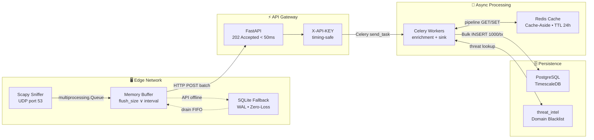

<div align="center">

# 🛡️ NovaGuard

### DNS Threat Intelligence & Network Defense Platform

[](https://github.com/soneylegal/novaguarda/actions/workflows/ci.yml)
[](https://www.python.org/)
[](https://github.com/psf/black)
[](LICENSE)

**Enterprise-grade distributed pipeline** for real-time DNS traffic ingestion, threat enrichment, and analysis.  
Designed for **millions of logs/day** with sub-50ms ingestion latency and **zero data loss** guarantees.

</div>

---

## Architecture



### Data Flow (End-to-End)

| Stage | Component | Operation | SLA |
|:---:|---|---|:---:|
| **1** | Scapy Process | Packet capture (`udp port 53`, `store=False`) | Real-time |
| **2** | IPC Queue | `multiprocessing.Queue` → BufferSender process | < 1ms |
| **3** | BufferSender | Accumulate → HTTP POST batch to API Gateway | ≤ flush interval |
| **4** | FastAPI | Validate payload, enqueue to Celery | **< 50ms** (202) |
| **5** | Enrichment Worker | Cache-Aside: Redis → `threat_intel` → classify | < 200ms |
| **6** | Sink Worker | `INSERT INTO dns_logs VALUES (...) × 1000` | < 500ms |
| **7** | Fallback | SQLite WAL + Exponential Backoff (2s → 300s cap) | Zero-loss |

---

## Tech Stack

| Layer | Technology | Purpose |
|---|---|---|
| **API** | FastAPI | Async I/O, OpenAPI native, Pydantic v2 validation |
| **Task Queue** | Celery + Redis | Async processing with dedicated queues (`enrichment`, `sink`) |
| **Cache** | Redis 7 | Cache-Aside with pipeline batch (TTL 24h, sub-ms latency) |
| **Database** | PostgreSQL 16 + TimescaleDB | Time-series optimized with composite indexes |
| **ORM** | SQLAlchemy 2.0 | Dual engine: async `asyncpg` (API) + sync `psycopg2` (Workers) |
| **Edge Capture** | Scapy | DNS parsing in userspace, isolated in `multiprocessing.Process` |
| **Resilience** | SQLite WAL | Local fallback with exponential backoff, zero data loss |
| **Auth** | API Keys (`X-API-KEY`) | `secrets.compare_digest` — immune to timing side-channel |
| **CI/CD** | GitHub Actions | Lint (Black, Ruff, MyPy) + Tests with real PostgreSQL/Redis |
| **Containers** | Docker Compose | Full stack with healthchecks and wait-for-db |

---

## Quick Start

### 1. Clone & Configure

```bash
git clone https://github.com/soneylegal/novaguarda.git
cd novaguarda
cp .env.example .env
```

### 2. Launch Backend (Docker)

```bash
docker compose up -d --build
```

| Service | URL | Description |
|---|---|---|
| API Gateway | `http://localhost:8000` | FastAPI (OpenAPI docs at `/docs`) |
| Swagger UI | `http://localhost:8000/docs` | Interactive API documentation |
| Flower | `http://localhost:5555` | Celery worker monitoring |
| PostgreSQL | `localhost:5432` | TimescaleDB (time-series storage) |
| Redis | `localhost:6379` | Cache (DB0) + Broker (DB1) |

### 3. Seed Threat Intelligence

```bash
# Base threats (phishing, malware domains)
docker compose run --rm api python -m scripts.seed_threat_intel

# Stress test threats (c2_server, phishing, malware mix)
docker compose run --rm api python -m scripts.seed_mixed_test
```

---

## Edge Agent Setup

The Edge Agent captures live DNS traffic and streams it to the API Gateway. It requires **root privileges** (or `CAP_NET_RAW`) and runs outside Docker on the target machine.

### Install Dependencies

```bash
python -m venv .venv
source .venv/bin/activate
pip install -e ".[dev]"
```

### Launch Agent

```bash
# Via wrapper script (recommended — handles venv + sudo)
./run_agent.sh --interface enp1s0 --buffer-size 50 --buffer-interval 5

# Or directly
sudo ./.venv/bin/python -m agent.sniffer \
  --interface enp1s0 \
  --api-url http://localhost:8000/api/v1/ingest/ \
  --api-key "agent-key-alpha-001" \
  --buffer-size 50 \
  --buffer-interval 5
```

> **Graceful Shutdown:** Press `Ctrl+C` once. The agent stops Scapy, drains the IPC queue, flushes remaining logs to the API (3s timeout), and exits cleanly. No `Ctrl+Z` needed.

---

## Validation — Stress Test

Use this procedure to validate the full pipeline after deployment:

```bash
# ── Terminal 1: Watch worker logs ──────────────────────────────
docker compose logs -f worker

# ── Terminal 2: Seed + Flush cache + Launch agent ──────────────
docker compose run --rm api python -m scripts.seed_mixed_test
docker compose exec redis redis-cli FLUSHALL
./run_agent.sh --interface enp1s0 --buffer-size 1 --buffer-interval 2

# ── Terminal 3: Fire test threats ──────────────────────────────
for domain in c2-strike.net phishing-banco.com malware-drop.org stealer-payload.info; do
  echo "→ Resolving $domain"
  nslookup "$domain"
  sleep 1
done
```

**Expected Worker Output:**

```
[INFO] Loaded 8 threat domains from DB.
[INFO] Batch #1 enrichment complete: malicious_count=4
[INFO] Task workers.intel_tasks.process_and_enrich_batch[...] succeeded
[INFO] Sync bulk insert: 4 DNS logs persisted.
[INFO] Task workers.sink_tasks.bulk_persist_logs[...] succeeded
```

✅ All 4 domains classified as `malicious` via `threat_intel` lookup → cached in Redis → persisted in PostgreSQL.

---

## API Reference

### Ingestion (High Performance)

| Method | Route | Description | Auth | Response |
|---|---|---|---|---|
| `POST` | `/api/v1/ingest/` | Receive batch of DNS logs | `X-API-KEY` | `202 Accepted` |

### Query (Dashboard)

| Method | Route | Description | Auth |
|---|---|---|---|
| `GET` | `/api/v1/query/logs` | Paginated listing with filters (domain, threat, agent, IP, period) | `X-API-KEY` |
| `GET` | `/api/v1/query/stats` | Aggregated statistics (total, 24h, by severity) | `X-API-KEY` |
| `GET` | `/api/v1/query/threats` | Top N malicious domains with source IPs | `X-API-KEY` |
| `GET` | `/api/v1/query/health` | Health check (Redis, PostgreSQL, Celery) | Public |

---

## Design Patterns

### 🏗️ Repository Pattern

Business logic **never touches the ORM directly**. All database access flows through typed repositories, enabling engine swaps (e.g., PostgreSQL → ClickHouse) without modifying business rules. Unit tests use `MagicMock` sessions — **zero infrastructure dependency**.

### ⚡ Cache-Aside (Redis Pipeline Batch)

Each log batch is deduplicated by domain. The enrichment worker executes a **Redis pipeline** (N GETs in 1 roundtrip). Cache hits return instant classification. Misses query `threat_intel`, classify, and populate cache with **24h TTL**. After warm-up, **95%+ domains resolve via cache**.

### 🔄 IPC via multiprocessing (GIL-Free)

Scapy and the HTTP sender run in **separate OS processes** communicating via `multiprocessing.Queue`. No thread contention, no GIL blocking. Shutdown uses a `STOP_SENTINEL` pattern for deterministic drain.

### 📦 Bulk Inserts (1000/transaction)

Logs are persisted in batches of **1,000 records per transaction** via raw `INSERT INTO ... VALUES`. Larger batches auto-partition into chunks to avoid prolonged locks. This reduces transaction count by **~1000x** vs individual inserts.

### 🛡️ Zero Data Loss (SQLite Fallback)

If the API is unreachable, logs are persisted in local **SQLite (WAL mode)** with exponential backoff: `2s → 4s → 8s → ... → 300s cap`. On reconnection, the agent **drains SQLite in FIFO order** before sending new data.

---

## Project Structure

```
novaguarda/
├── agent/                          # 🖥️ Edge Sniffer (target machines)
│   ├── sniffer.py                  #    Orchestrator: Scapy + Sender processes
│   └── buffer_sender.py            #    Queue-driven sender + SQLite fallback
├── backend/
│   ├── main.py                     # ⚡ FastAPI + Middlewares + CORS + Lifespan
│   ├── core/
│   │   ├── config.py               #    Pydantic Settings (.env)
│   │   ├── security.py             #    API Key auth (timing-safe)
│   │   └── cache.py                #    Redis singleton + Cache-Aside batch
│   ├── api/v1/
│   │   ├── ingest_router.py        #    POST /ingest → 202 Accepted
│   │   └── query_router.py         #    GET /logs, /stats, /threats, /health
│   ├── domain/
│   │   └── schemas.py              #    DNSLogItem, LogBatchCreate, EnrichedLog
│   ├── infrastructure/
│   │   ├── db/
│   │   │   ├── session.py          #    Async + Sync engines (dual pool)
│   │   │   └── models.py           #    DNSLog, ThreatIntel, AgentRegistry
│   │   └── repositories/
│   │       ├── base.py             #    Generic CRUD (Generic[ModelType])
│   │       └── log_repo.py         #    Bulk insert + aggregations + dashboard
│   └── workers/
│       ├── celery_app.py           #    Queues: enrichment, sink + schema inspector
│       ├── intel_tasks.py          #    Cache-Aside enrichment (leak-proof)
│       └── sink_tasks.py           #    Chunked bulk persist (leak-proof)
├── scripts/
│   ├── seed_threat_intel.py        #    ORM seed: base threat domains
│   └── seed_mixed_test.py          #    ORM seed: stress test domains
├── tests/
│   ├── e2e/                        #    TestClient + dependency_overrides
│   └── unit/                       #    pytest + MagicMock (29 tests)
├── .github/workflows/ci.yml       #    CI with PostgreSQL + Redis containers
├── docker-compose.yml              #    Full stack with healthchecks
├── Dockerfile                      #    Multi-stage build (python:3.11-slim)
├── alembic/                        #    Database migrations (autogenerate)
└── pyproject.toml                  #    Dependencies + Black + Ruff + MyPy
```

---

## Environment Variables

All centralized in `.env` and loaded via `pydantic_settings.BaseSettings`:

| Variable | Description | Default |
|---|---|---|
| `DATABASE_URL` | PostgreSQL async (`asyncpg`) | `postgresql+asyncpg://...` |
| `DATABASE_URL_SYNC` | PostgreSQL sync (`psycopg2`) | `postgresql+psycopg2://...` |
| `REDIS_URL` | Redis cache (DB 0) | `redis://localhost:6379/0` |
| `CELERY_BROKER_URL` | Redis broker (DB 1) | `redis://localhost:6379/1` |
| `API_KEYS` | JSON array of authorized keys | `[]` |
| `RATE_LIMIT` | Request rate limit (slowapi) | `60/minute` |
| `CACHE_TTL_SECONDS` | Redis cache TTL | `86400` (24h) |
| `BULK_INSERT_SIZE` | Logs per insert transaction | `1000` |

---

## Testing

> **29 tests passing** — Unit + E2E — with full infrastructure mocking.

```bash
pytest tests/ -v --cov=backend --cov=agent --cov-report=term-missing
```

| Suite | Tests | Strategy |
|---|:---:|---|
| `test_schemas.py` | 11 | Pydantic validation (domain, IP, batch, enum) |
| `test_buffer_sender.py` | 9 | Buffer, flush, backoff, SQLite fallback |
| `test_celery_tasks.py` | 4 | Enrichment + sink task smoke tests |
| `test_repository.py` | 4 | SyncLogRepository (bulk, threats, close) |
| **Total** | **29** | **Zero infrastructure dependency** |

---

## License

Distributed under the MIT License. See [`LICENSE`](LICENSE) for details.

© 2026 Davi Laurindo
